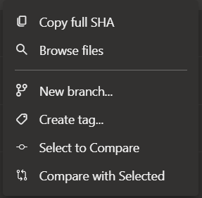

# Introduction
Compare two git commits right from DevOps Git Commit history.

# Usage

**Commit Compare** extension adds two menu options to Git commit history view.

- Select to Compare : Selects commit to start compare
- Compare with Selected: Opens comparison in new window setting current comment as target

Usage:
1. Go to history in Azure Devops repos
2. Select a commit to set as base version for comparison using *Select to Compare*
3. Now choose the commit version you want to compare and select the *Compare with Selected* option to view the comparison in a new tab.

# Contributions
- This extension is built using/based on sample extension code from microsoft available at [Link to Azure devops github repo](https://github.com/microsoft/azure-devops-extension-sample)
- Free Icons used from library [Ionicons Outline](https://www.iconbolt.com/iconsets/ionicons-outline). [Licensed Under MIT ](https://opensource.org/license/MIT)
- Extension is based on the response for stack overflow question about [comparing commits in devops web ui](https://stackoverflow.com/questions/59533905/azure-devops-compare-two-commits-right-in-the-web-ui/60229869#60229869). Thanks to [George Helyar](https://stackoverflow.com/users/2486830/george-helyar).
